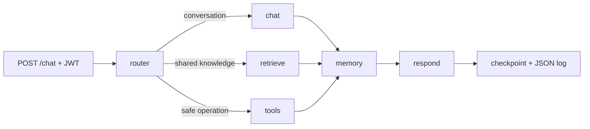

# Chatbot Multi-Node Template

A synchronous, general-purpose chatbot API built with Python 3.12, FastAPI, LangChain, and LangGraph. It uses explicit graph routing, short-term checkpoints, opt-in durable memory, shared Markdown retrieval, and a small allow-list of offline-safe tools.



The normal path makes two model calls: structured routing and final response. Memory extraction is skipped unless the request explicitly sends `"memory_consent": true`.

## Included components

- Six-node LangGraph workflow: `router`, `chat`, `retrieve`, `tools`, `memory`, `respond`
- OpenAI through `langchain-openai`, with the model selected only by `OPENAI_MODEL`
- SQLite checkpoints and durable memory locally; PostgreSQL support for production state
- Persistent local Chroma index built from application-owned Markdown
- Calculator, current-time, and knowledge-search tools with strict validation and output limits
- Fixed bcrypt credential login and 30-minute HS256 JWT access tokens
- Authenticated memory list/delete endpoints with owner-scoped queries
- Structured JSON logs with validated correlation IDs and no request-body logging
- Offline pytest suite with fake model/embedding boundaries
- Docker, Compose, CI, sample knowledge, and versioned evaluation cases

## Quick start

1. Create the environment and install the locked dependencies.

   ```bash
   cp .env.example .env
   uv sync
   ```

2. Generate the fixed operator's bcrypt hash using hidden terminal input.

   ```bash
   uv run chatbot hash-password
   ```

   Put the output in `AUTH_PASSWORD_HASH`. Because bcrypt hashes contain `$`, wrap the value in single quotes in `.env`, for example `AUTH_PASSWORD_HASH='$2b$...'`. Set `AUTH_USERNAME` to the fixed login name. Do not store the plaintext password in source control or documentation.

3. Generate a high-entropy JWT secret and put it in `JWT_SECRET`.

   ```bash
   uv run python -c "import secrets; print(secrets.token_urlsafe(48))"
   ```

4. Set `OPENAI_API_KEY` and choose an available model in `OPENAI_MODEL`. The project intentionally does not hard-code a model; check the [current OpenAI model guide](https://developers.openai.com/api/docs/models) for your latency, quality, and cost needs.

5. Build the shared knowledge index, then run one local API worker.

   ```bash
   uv run chatbot ingest
   uv run uvicorn chatbot.api.app:app --reload
   ```

SQLite serializes checkpoint writes, so keep local development to one worker. Use PostgreSQL before scaling workers.

## API

| Method | Path | Authentication | Purpose |
| --- | --- | --- | --- |
| `GET` | `/health/live` | No | Process liveness |
| `GET` | `/health/ready` | No | Database readiness |
| `POST` | `/auth/token` | No | Exchange the fixed credentials for a JWT |
| `POST` | `/chat` | Bearer JWT | Run one complete non-streaming graph turn |
| `GET` | `/memories` | Bearer JWT | List the authenticated subject's durable memories |
| `DELETE` | `/memories/{id}` | Bearer JWT | Delete one owned durable memory |

Token request:

```json
{
  "username": "<configured username>",
  "password": "<operator password>"
}
```

Chat request:

```json
{
  "session_id": "demo-session",
  "message": "Remember that I prefer concise answers.",
  "memory_consent": true
}
```

`memory_consent` defaults to `false` on every request. A previously consented turn cannot make consent sticky because consent is supplied through non-persisted runtime context and checked again by the memory repository.

## Configuration

| Variable | Required | Description |
| --- | --- | --- |
| `OPENAI_API_KEY` | Yes | OpenAI project API key |
| `OPENAI_MODEL` | Yes | Chat, router, and memory-extraction model ID |
| `OPENAI_EMBEDDING_MODEL` | No | Defaults to `text-embedding-3-small` |
| `AUTH_USERNAME` | Yes | One fixed operator username |
| `AUTH_PASSWORD_HASH` | Yes | Bcrypt hash generated by the CLI |
| `JWT_SECRET` | Yes | At least 32 bytes; signs HS256 access tokens |
| `DATABASE_URL` | No | Defaults to local SQLite; accepts PostgreSQL |
| `CHROMA_PERSIST_DIRECTORY` | No | Local Chroma files |
| `KNOWLEDGE_DIRECTORY` | No | Application-owned Markdown root |
| `LOG_LEVEL` | No | `DEBUG`, `INFO`, `WARNING`, `ERROR`, or `CRITICAL` |
| `LANGSMITH_*` | No | Optional tracing configuration; not required by tests |

Fixed credentials are deliberately a single-operator/demo mechanism. Everyone who knows them receives the same JWT subject and can access that subject's saved memories. Replace this with distinct identities before offering the service to multiple users.

If optional LangSmith tracing is enabled, review its retention and redaction settings first: model traces can contain user messages and retrieved or remembered context.

## Knowledge and production storage

Only Markdown committed under `knowledge/` is indexed. There is no upload API. Run `uv run chatbot ingest` after changing those files; requests reuse the existing Chroma collection and never rebuild it.

Compose uses a PostgreSQL image with the `pgvector` extension available. The current application uses PostgreSQL for checkpoints and durable memories while retaining Chroma for retrieval. A production pgvector migration should implement the existing small `KnowledgeBase.search()` interface, keep the embedding model consistent, and preserve the same context limits and prompt-injection boundary.

## Verification

```bash
uv run pytest
uv run ruff check .
uv run ruff format --check .
```

Tests cover JWT validation, checkpoint isolation, per-turn memory consent, memory ownership/deletion, router failure, retrieval injection boundaries, tool validation, SQLite checkpoint persistence, JSON-log safety, API contracts, and Chroma indexing. They do not require OpenAI credentials or network calls.

## Docker Compose

Set the required values in `.env`, including `POSTGRES_PASSWORD`, then run:

```bash
docker compose up --build
docker compose run --rm api uv run --no-sync chatbot ingest
```

The API is available on `http://localhost:8000`.

## Recommended agent skills

Future coding agents should start with [the project skill](skills/build-langgraph-chatbot/SKILL.md). Its recommended sequence is:

1. `ecosystem-primer` for framework selection and current documentation routing
2. `langchain-dependencies` when changing `pyproject.toml` or package versions
3. `langgraph-fundamentals` for graph state, nodes, and edges
4. `langgraph-persistence` for checkpoints, thread scoping, or cross-session memory
5. `langchain-rag` for Markdown ingestion, embeddings, Chroma, or pgvector work
6. `openai-docs` for current OpenAI models and API behavior
7. `tdd` for observable feature or bug-fix slices

Deep Agents, human-in-the-loop, LangGraph CLI, and orchestration skills are not needed for v1's explicit synchronous graph.
