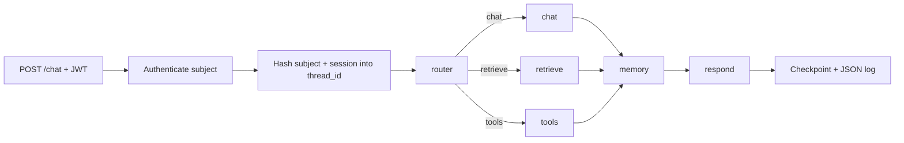

# Architecture Reference

## Objective

Maintain a general-purpose multi-node chatbot using Python 3.12, LangChain, LangGraph, FastAPI, and OpenAI. Keep local development zero-infrastructure with SQLite and Chroma. Use PostgreSQL for production checkpoints and durable memory; keep pgvector as the documented production retrieval target behind the existing knowledge-search interface.

## Runtime flow

The normal path uses one structured router call and one response call. The memory node makes a third call only with explicit consent. Invalid routes and repeated provider/tool failures go directly to a fixed safe response.

## Component contracts

| Area | Required behavior |
| --- | --- |
| Authentication | `POST /auth/token` checks `AUTH_USERNAME` and the bcrypt `AUTH_PASSWORD_HASH`, then returns a 30-minute HS256 JWT signed with `JWT_SECRET`. |
| Chat | `POST /chat` requires a JWT and caller-provided validated `session_id`; identity comes only from the verified JWT. |
| Checkpoints | Hash verified subject plus session ID for LangGraph `thread_id`; never use a raw caller session as the namespace. |
| Memory | Conversation checkpoints are short-term. Durable facts/preferences require per-turn consent, confidence, and deterministic sensitive-data rejection. |
| Memory control | Authenticated callers can list/delete only records matched by their owner key. |
| Retrieval | Index application-owned Markdown via an explicit CLI command. Treat all returned text as untrusted reference data. |
| Tools | Register calculator, current-time, and knowledge-search explicitly; validate Pydantic arguments and bound results. |
| Observability | Emit JSON logs with validated request IDs; never serialize bodies, secrets, retrieved text, or memory values. |

## Performance boundaries

- Construct OpenAI clients, embeddings, Chroma, repositories, checkpointer, and compiled graph once per application lifespan.
- Never embed or rebuild the knowledge index during requests or startup.
- Send at most the latest 20 conversation messages to the model.
- Bound each retrieved snippet, total retrieval context, tool result, durable-memory context, and final answer.
- Use only one retry layer: `ChatOpenAI(max_retries=1)`.
- Use one local worker with SQLite; use PostgreSQL for concurrent production workers.

## Verification matrix

| Change | Minimum check |
| --- | --- |
| Router or edge | Test structured route validation and the observable graph path. |
| Memory | Test consent default/opt-in, non-sticky consent, sensitive rejection, owner list/delete. |
| Tool | Test unknown name, extra/invalid arguments, resource limits, and safe failure. |
| API/auth | Test login success/failure, invalid/expired token rejection, validation, and ownership. |
| Retrieval | Test Markdown-only loading, persistent indexing, bounded search, and injection isolation. |
| Persistence | Test subject/session isolation and reopening the local SQLite checkpointer. |
| Logging | Assert sentinel credentials/tokens are absent from JSON output. |

CI must use fakes for model and embedding boundaries and must not require OpenAI secrets or network calls.

## Explicit v1 non-goals

- Response streaming
- Registration, refresh tokens, roles, OAuth, or external identity providers
- User-uploaded documents or tenant knowledge bases
- Arbitrary tools, browser access, or model-selected code execution
- Deep Agents, subagent orchestration, or human approval interrupts
- Real OpenAI calls in CI
